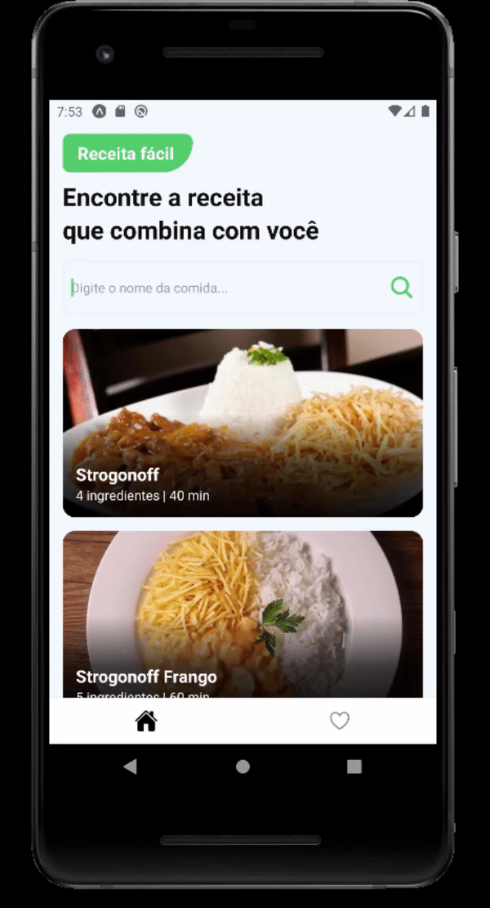

# App Receitas

# Sobre o projeto

 - O projeto é um app de receitas que lista algumas receitas e cada uma tem os seus ingredientes e modo de preparo. É possível ir para o vídeo ver como é feito e também favoritar suas receitas para consultar depois.
 - Foi utilizado o JSON server para criar uma API com as receitas.

# Layout Mobile 

    

# Tecnologias utilizadas 

- React Native
- JavaScript

